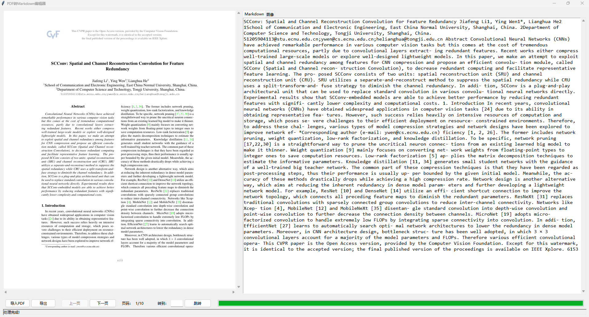

# PDF 转 Markdown 图像清洗工具

一个基于 Python 和 Tkinter 的图形化工具，用于对 **扫描型或双层 PDF 文档**进行文本提取、图像识别与标注清洗，并最终导出 Markdown 文件、图像文件夹与描述标签。




## Update

[2025-07-28]增加从编辑历史中恢复工作状态的功能

---

## 🎯 功能简介

- 支持导入任意 PDF（扫描版或文字层）
- 自动提取每页文本（支持 OCR）并显示为 Markdown 可编辑格式
- 自动识别页面中的图像区域并提取
- 图像预览界面支持：
  - 缩略图预览
  - 可编辑图像描述
  - 删除图像按钮（图像将从页面中剔除）
- 多页导航：上一页 / 下一页 / 跳转页面
- 支持导出为一个清洗后的 Markdown 文件，并附带图像及图例说明

---

## 📁 导出结构

导出结果将保存在你指定的文件夹中，以导入 PDF 文件名命名，例如导入文件为 `example.pdf`：

```

📁 example/
├── export.md                  ← 合并后的 Markdown 文本
├── descriptions.json          ← 图像文件名 -> 图例描述
├── 📁image\
└──── fig001.png                ← 所有保留图像（fig001.png ...）

````

---

## 🛠 安装与运行

### ✅ 环境要求

- Python 3.8+
- 推荐使用虚拟环境（conda / venv）

### ✅ 安装依赖

```bash
pip install -r requirements.txt
````

### ✅ 运行程序

```bash
python main.py
```

---

## 🖼️ 界面说明

| 区域 | 说明                         |
| -- | -------------------------- |
| 左侧 | PDF 预览区域（支持缩放与滚动）          |
| 右侧 | Tab 切换：Markdown 编辑器 / 图像列表 |
| 底部 | 导入、导出、翻页、跳转、进度条、状态栏        |

---

## 📝 使用说明
0. 记得首先要在/utils/extract_txt.py中填写百度OCR的API_KEY和SECRET_KEY 
1. 点击 **导入 PDF** 按钮，选择文件
2. 程序将自动提取文字和图像，显示于左右界面
3. 你可以：

   * 编辑每页的 Markdown 内容
   * 为图像添加说明文字
   * 删除不需要的图像
4. 操作完成后，点击 **导出** 按钮

   * 选择导出路径（文件夹）
   * 系统将自动创建 `{pdf文件名}/` 子文件夹并写入结果

---

## 💡 技术要点

* PDF 渲染：使用 [PyMuPDF](https://pymupdf.readthedocs.io/)
* 图像识别：OpenCV + 形态学图像处理（基于面积与矩形比）
* GUI：基于 Tkinter 实现，支持 Markdown 编辑、图像网格展示、动态 UI 更新
* 可扩展性强，适合集成 OCR API（如百度、Tesseract）或深度图像分类模型

---

---

## 📄 License

MIT License

---

## 🙋‍♂️ 作者

开发者：@Xpg74138
联系：xin1099477816@163.com


